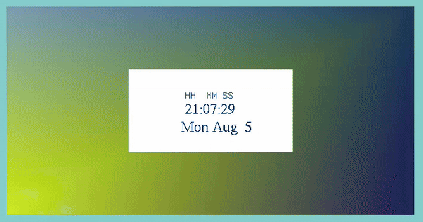

# Digital Clock Project - OpenGL

> This project serves as a comprehensive academic exploration into the use of OpenGL for rendering and displaying a functional digital clock. The aim is to provide an illustrative example of how OpenGL can be utilized to create and manage real-time graphical applications with practical utility.

## Overview
The Digital Clock Project demonstrates how to use OpenGL, a powerful graphics library, to render a digital clock interface. This project encompasses various aspects of OpenGL programming, including:

* Rendering Text: Learn how to render text in OpenGL using techniques such as bitmap fonts and texture mapping.
* Time Management: Understand how to manage and display real-time data, specifically the current time, using OpenGL.
* Event Handling: Implement event handling to update the clock in real-time and manage user interactions.
* Animation: Gain insight into animating updates to ensure the clock reflects the current time accurately.

## Key Features
* Real-Time Display: The clock updates every second to reflect the current time.
* Customizable Appearance: The appearance of the clock can be customized through OpenGL settings and shaders.
* Cross-Platform Compatibility: Designed to run on various platforms supported by OpenGL, including Windows, macOS, and Linux.

## Prerequisites
To run and contribute to this project, you should have:

* Basic knowledge of C++ programming.
* Familiarity with OpenGL.
* A development environment set up with OpenGL libraries and dependencies.

## Getting started

1. Clone the repository
``
$ sudo apt-get install freeglut3-dev 
``
2. Compile
``
$ g++ main.cpp -o app -lglut -lGLU -lGL
``
3. Run program
``
./app
``
## Contributing
We welcome contributions to enhance the Digital Clock Project. If you have suggestions, bug reports, or improvements, please open an issue or submit a pull request.